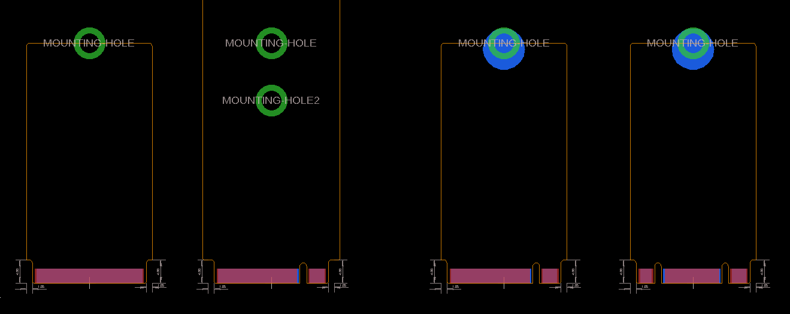

# M.2-Card-Footprints

The footprints were created in Eagle. The KiCad versions are imports, they are looking good to me but you might want to look for quirks if you plan on using them in production.

The only footprint that has been verified with a PCB is the B-Key footprint. Though they all derive from the blank key footprint.
So as long as the correct pads are removed and the key is in the right place you should have no issues with other keys.
For the key position check out the spec sheet linked at the bottom.

You can use the blank key footprint to create any other M.2 key like A or E Key A+E etc.

By default they are 2242 but if you want longer cards you just push the top edge of the outline including the half hole up to the dimension you want. So instead of having it sit at 42mm vertical (y-axis) height you push it to f.e. 80mm if you want 2280. The same principal if you want a 30mm wide card, you extend the left and right edge 4mm further out.

M.2 Keying always uses the same pin names, you just delete some of the pads depending on which key is used and move the notch in that place.

You can find all the information you need about M.2 devices and their pinout in this M.2 Specs. You can find the doc on archive.org: https://web.archive.org/web/20200613074028/http://read.pudn.com/downloads794/doc/project/3133918/PCIe_M.2_Electromechanical_Spec_Rev1.0_Final_11012013_RS_Clean.pdf
